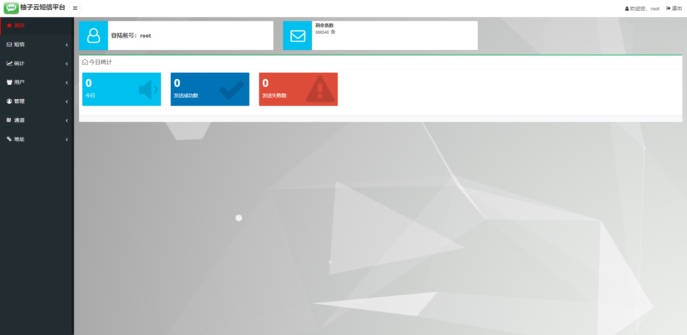

# pomelo-sms

柚子云短信平台

## 项目实例

### 在线演示

[柚子云短信平台](http://sms.pomelo.work)

账号密码：`test/test123`

### 图例

登录页

首页

### 技术栈

- SpringBoot
- MySQL
- SMPP
- Netty
- Redis
- Bootstrap

## 能力

### HTTP API
可对接多种三方短信API

### SMPP客户端
作为SMPP客户端发送

## MIT